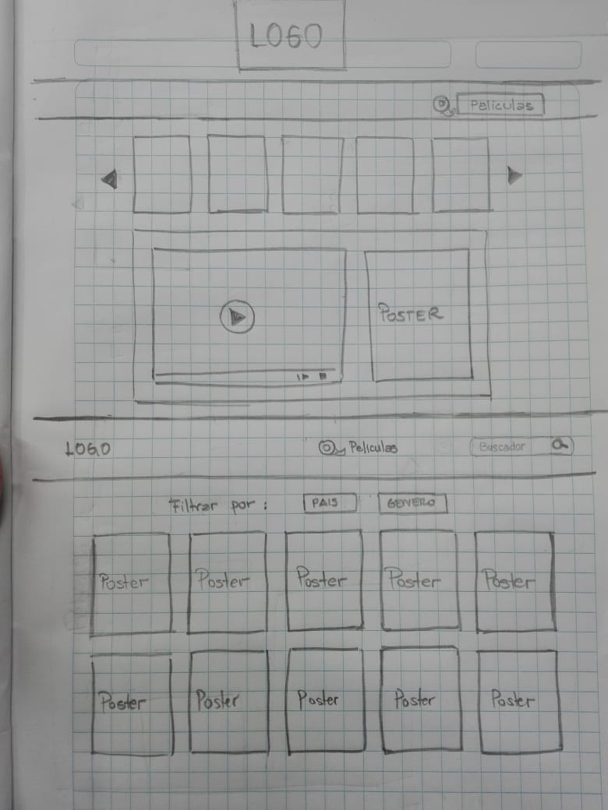
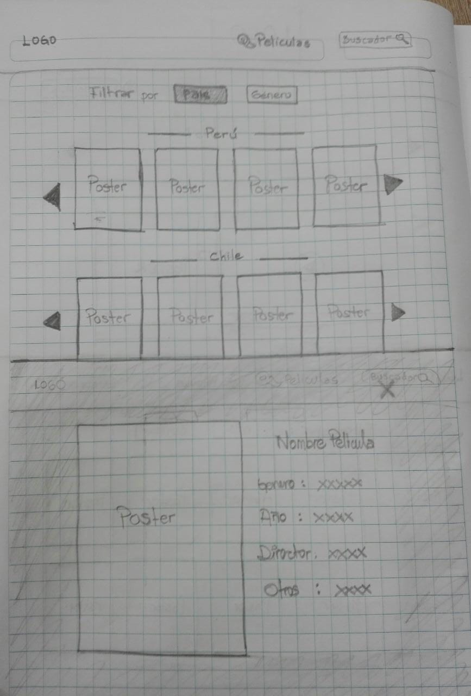

## *CINE LATIN*

 - Es una pagina Web que muestra peliculas pertenecientes al cine
   Latinoamericano. Permite visualizar peliculas
   recomendadas, peliculas organizadas por pais donde fueron producidas
   y por género al cual pertenecen.

## Imagen final de nuestro proyecto.

*Recomendados*
<!--  -->

*Películas*
<!--  -->

*Buscador*
<!--  -->

*Modal*
<!--  -->

## Investigación UX:
  - Este proyecto esta orientado a personas que desean tener mas informacion sobre cine hecho en Latinoamerica y cumple el objetivo de generar un canal de difusion de peliculas que no siempre llegan a mostrarse en cines comerciales.
  
    - Nuestro usuario objetivo tiene la necesidad de consumir producciones de cine latinoamericano y se encuentra con el problema de la escaza existencia de espacios donde se difunden este tipo de cine.
    

## *Prototipo de baja fidelidad*

Feedback 
-Este proyecto fue testeado y el resumen de las apreciaciones y mejoras propuestas son las siguientes:

- El usuario recomendo que la primera pagina tuviera los botones de "Recomendados", "Pelicula" y el icono que permite buscar en la barra de navegación. 
Lo cual fue actualizado en la primera página.

- En la tercera pagina, el usuarion nos dio feedback sobre la visualizacion de los filtros, que se filtre solo lo seleccionado por pais o por género.
Hemos incorporado esto en la tercera pagina, eliminando la division predeterminada por paises que se propuso en el prototipo en papel.

- El usuario propuso que se visualizara la informacion en todas las peliculas, en forma de modal. 
Se incorporo esto en todas las paginas.